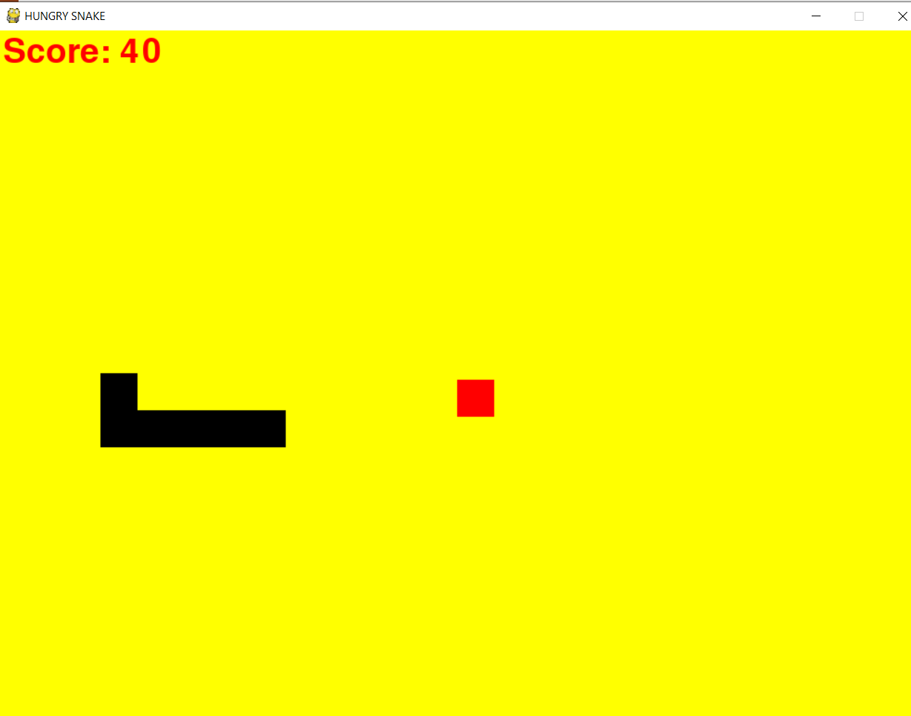

## THIS REPOSITORY IS MADE FOR DEVELOPING A SANKES GAME USING PYTHON
:star: :star: :star:
In this repository, we basically use pygame and use its modules , for the creation of the snakes game .

 😛 
* *TUTORIAL 1*
* *TUTORIAL 2*
* *TUTORIAL 3*
* *TUTORIAL 4*
* *TUTORIAL 5*
* *TUTORIAL 6*

#  HERE I DO ATTACH THE SCREENSHOT OF THE LIVE GAME I PLAY WITH  :heart_eyes::

